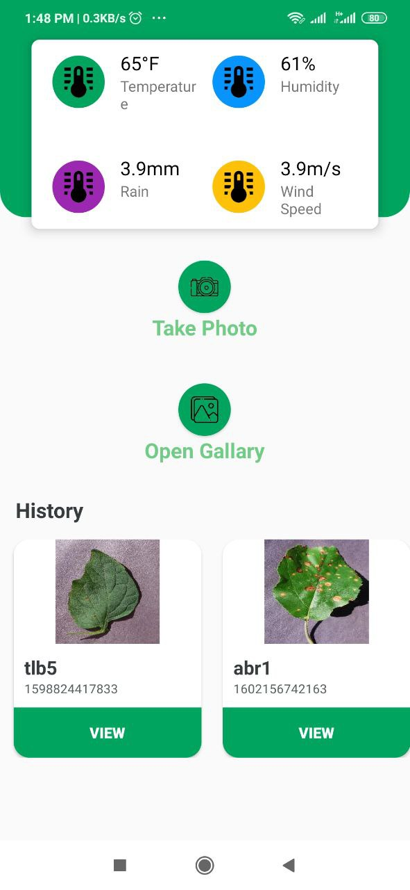
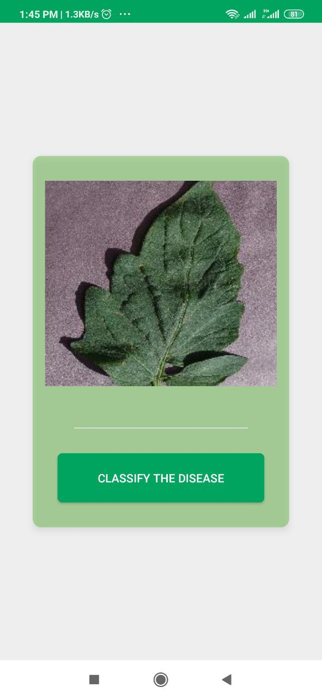
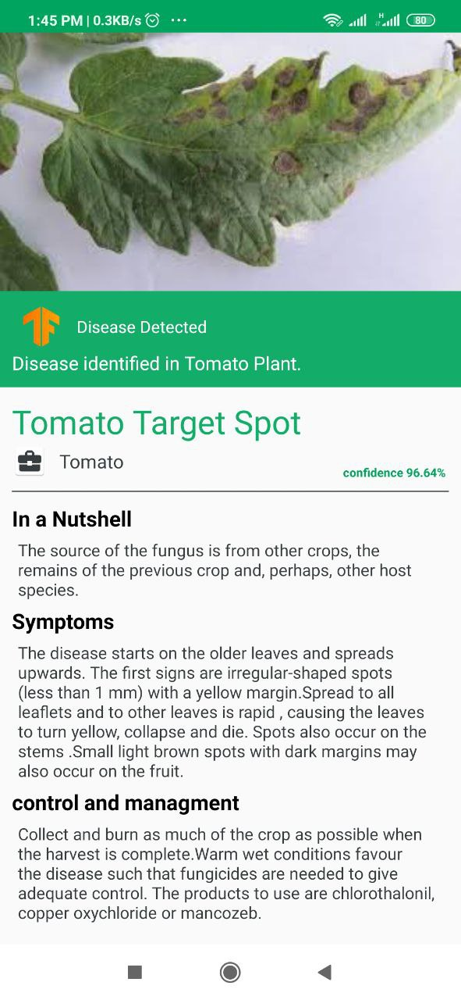
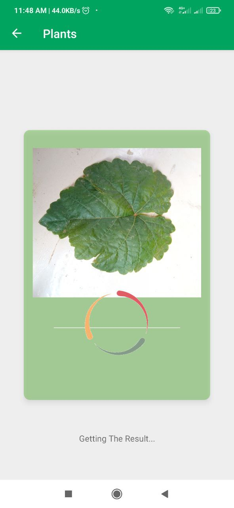
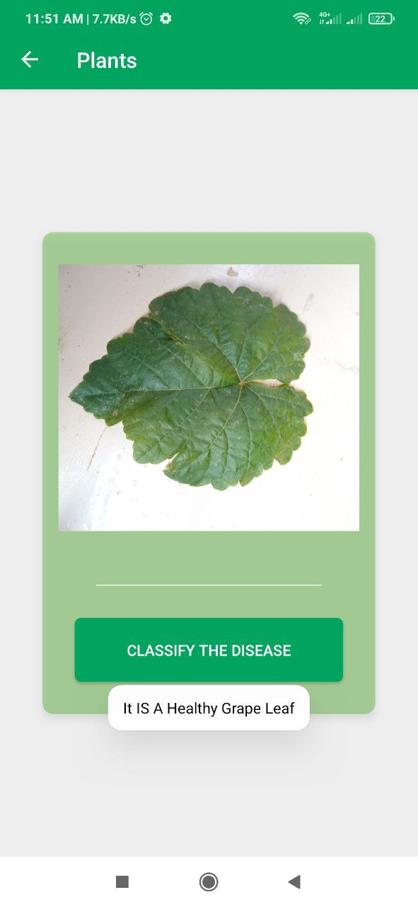
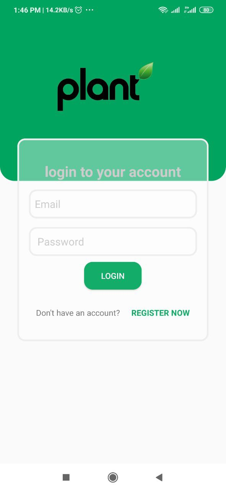

## Plant App

This repo contains the fornt end code for the (Plant App) project done by me and @Maen_Badea.

The project is an android application that classifies several plants diseases using computer vision.

The app works online through internet. It sends the image to the server that hosts the machine learning model that classifies the image.

Now the app covers more than 20 diseases for many plants like (potatos, grap, tomatoes, and others)

**After you click the 'CLASSIFY THE DISEASE' button you just need to wait for few seconds to receive:**
- [x] Detailed description about the detected disease and its symptoms.
- [x] How to treat the disease.
- [x] Images showing some affected leaves.

**We trained many models on Plant Village dataset, including:**
- [x]  ResNet18
- [x]  ResNet50
- [x]  InceptionV3
- [x]  DenseNet
- [x]  MobileNet

All the models achieve >90% accuracy.

If no disease is detected you will see the text message telling you that the leaf is healthy.

**Some screenshots from the app (the app will be released in the future).**

<!--   <tr>
    <td>First Screen Page</td>
     <td>Holiday Mention</td>
     <td>Present day in purple and selected day in pink</td>
  </tr> -->
  
 
<table>

  <tr>
    <td></td>
    <td></td>
    <td></td>
  </tr>
    
</table>

<table>

  <tr>
     <td></td>
    <td></td>
    <td></td>
  </tr>
    
</table>

